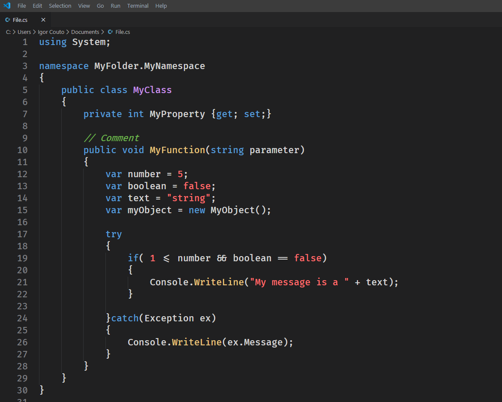

 
 
 # Valenca Theme  
 
A dark theme for Visual Studio Code inspired on default Dark+ and Atom's One Dark theme. Do you think the default Visual Studio Code theme is good but lacking indicative colors? Confused by the huge amount of colors on Atom? Follow the middle way with Valenca.

The color pallete rule: 
&nbsp;&nbsp;&nbsp;&nbsp; Reserved words - Blue Havelock Blue 
&nbsp;&nbsp;&nbsp;&nbsp; Primitive types - Red Bittersweet 
&nbsp;&nbsp;&nbsp;&nbsp; Types - Purple Biloba Flower 
&nbsp;&nbsp;&nbsp;&nbsp; Comments - Green Chelsea Cucumber 
&nbsp;&nbsp;&nbsp;&nbsp; Functions - Yellow Harvest Gold 
&nbsp;&nbsp;&nbsp;&nbsp; All the rest - White Wild Sand 

For those who believe that simplicity is the ultimate degree of sophistication, let Valenca guide your eyes during a pleasant coding session.

## Installing
* This extension will be available for free in the Visual Studio Code Marketplace in the future.
* To start using Valenca, copy it into the `<user home>/.vscode/extensions` folder and restart Visual Studio Code. Then open VS Code and go to `File>Preferences>Color Theme` and select Valenca.

## Feedback

* Working in progress. There are still some adjustments to be made to suport lenguages like Javascript for instance
* If you are having problems, please let me know by [filing an issue](https://github.com/igor-couto/vscode-valenca-theme/issues)

## License

Licensed under the [MIT](LICENSE) license.

## Author

* **Igor Couto** - [igor.fcouto@gmail.com](mailto:igor.fcouto@gmail.com)

**Enjoy!**
